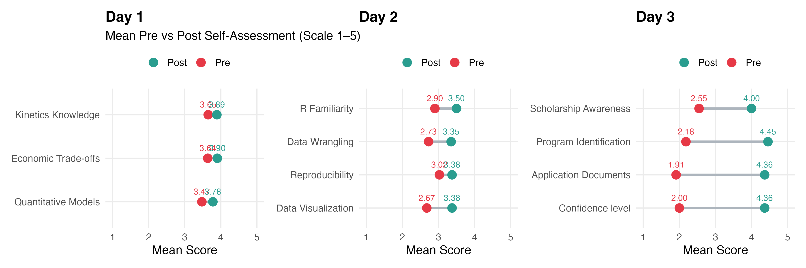
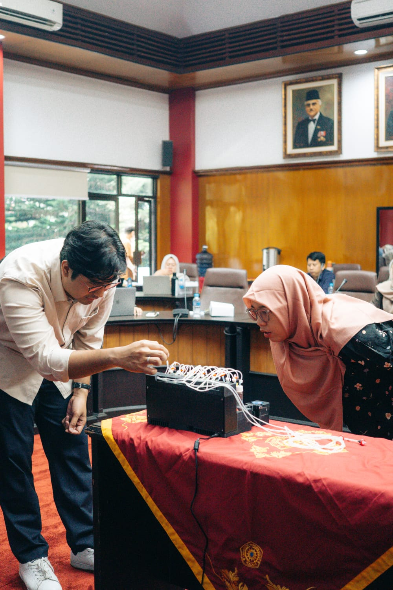
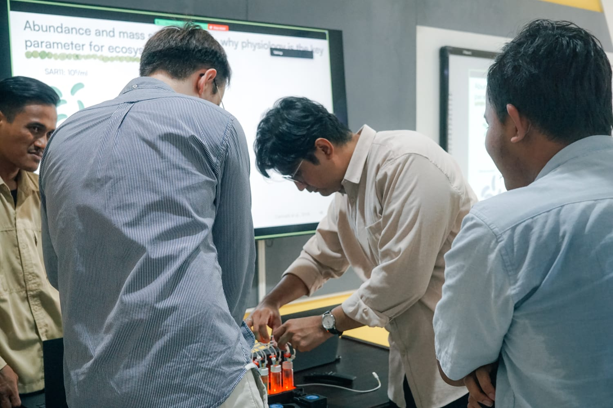
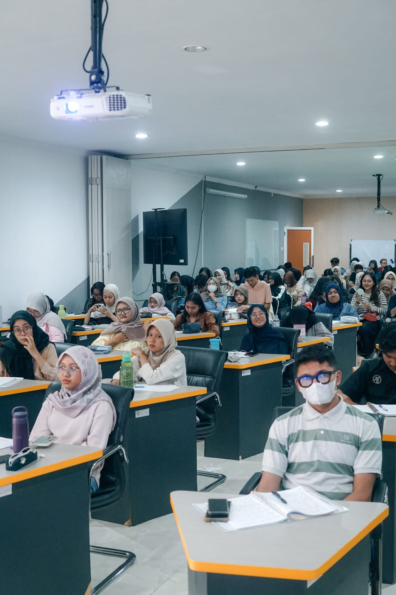
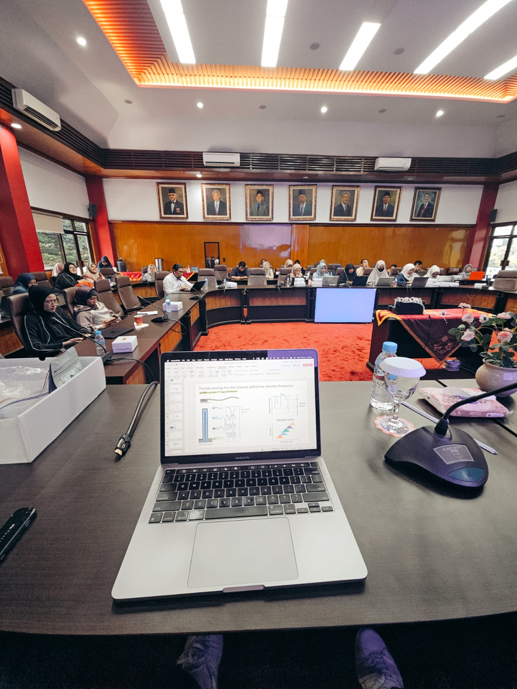
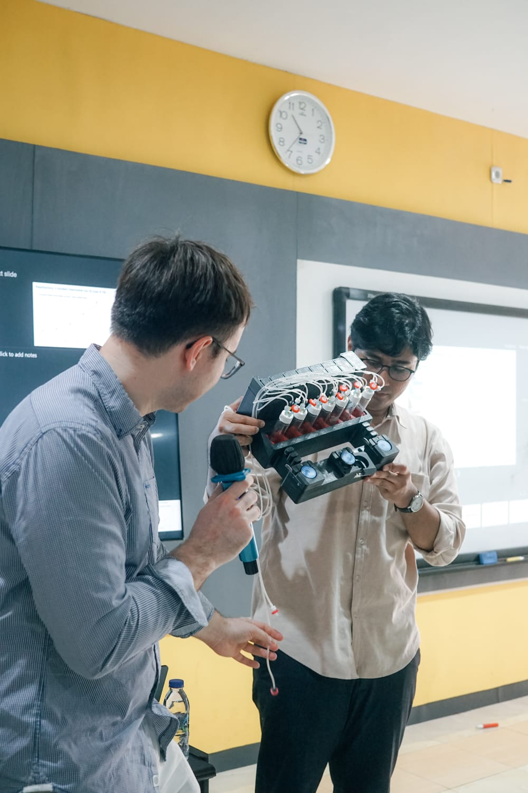
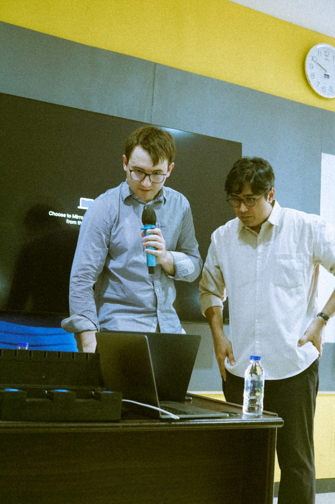

The [Global Ambassador Program (GAP)](https://www.microplanet.at/), launched by the Scientific Committee for Equal Opportunities (SCEO) of the **Cluster of Excellence MicroPlanet**, supports international trainees who have overcome educational or socioeconomic barriers and enables them to strengthen scientific links between the CoE and their home countries. This outreach program was carried out over six days across two partner institutions in Indonesia, combining scientific dissemination, practical skill transfer, and structured academic mentoring.

Undergraduate biology education at many Indonesian universities remains disconnected from contemporary research practice. Computational biology and reproducible analysis are largely absent from the curriculum, which relies heavily on click-based software such as SPSS. This obscures analytical logic and prevents students from understanding how results are constructed or reproduced. In parallel, pathways to international MSc and PhD programs are opaque — students lack the framework to identify funded positions, understand evaluation criteria, or communicate effectively with potential supervisors. These barriers are structural and often unspoken, causing talent to be lost before it is ever fairly evaluated.

The program was delivered at two institutions, with three full days of activities at each.

**Day 1 – Economic Principles of Microbial Growth: Allocation, Trade-offs, and Quantitative Models** \
Introduction to microbial growth kinetics, bioreactors, and the integration of computation in microbiology, drawing from MicroPlanet WP 7.1 research themes. Around **200 students** joined in a hybrid format at Institut Teknologi Sepuluh Nopember (ITS), and it turned into a lively discussion about microbiology, research, and career paths in science. The session at ITS was delivered together with [Catalin Rusnac](https://www.linkedin.com/in/cata7in/) from Replifactory.

**Day 2 – R for Biologists: Data Wrangling, Visualization, and Reproducible Analysis**\
Hands-on workshop focusing on transparency, scripting, and interpretation. Shifting students from click-based workflows toward script-based and reproducible analysis.

**Day 3 – Preparing for Graduate Studies Overseas: Applications, Funding, and Mentorship Session**\
Structured guidance on identifying funded PhD positions, scholarships, supervisor communication, and strategic self-presentation.

At [Universitas Muhammadiyah Malang (UMM)](https://www.umm.ac.id/), we held sessions with faculty members from several departments. The discussion covered similar topics and turned into a thoughtful exchange about research, studying overseas, and scientific collaboration.

On the last day, I returned to my hometown and visited my old high school. Standing there again, but this time sharing my journey as someone who left, studied abroad, and is now doing a PhD, felt quite emotional. It made me reflect on how far the journey has been, and how important it is for younger students to see that **pursuing a university degree is possible**.

To measure the impact of the program, participants completed a self-assessment questionnaire before and after the sessions (scale 1–5). The results are summarized in the dumbbell chart below.

**Day 1 (Guest Lecture)** showed modest gains in kinetics knowledge (3.65 → 3.89), economic trade-offs (3.63 → 3.90), and quantitative models (3.43 → 3.78), reflecting increased conceptual exposure.

**Day 2 (Technical Workshop)** saw improvements across all four metrics: R familiarity (2.90 → 3.50), data wrangling (2.73 → 3.35), reproducibility (3.02 → 3.38), and data visualization (2.67 → 3.38), indicating meaningful skill development during the hands-on session.

**Day 3 (Graduate Preparation)** recorded the largest shifts. Confidence level jumped from 2.00 to 4.36, application document knowledge from 1.91 to 4.36, program identification from 2.18 to 4.45, and scholarship awareness from 2.55 to 4.00. These results suggest that structured guidance on graduate pathways addressed a significant knowledge gap.

### Partner Institutions

| Institution | 
|---|
| [Institut Teknologi Sepuluh Nopember (ITS)](https://www.its.ac.id/), Surabaya | 
| [Universitas Muhammadiyah Malang (UMM)](https://www.umm.ac.id/), Malang | 

> This experience reminded me why science outreach matters.

Standing in front of students and early-career researchers like me, I wanted to show that a path in science, even the unconventional and messy kind, is something real and within reach. I am grateful for the chance to represent CoE MicroPlanet, and it meant a lot to come back and reconnect with the communities that shaped where I started.

### The Journey from Vienna to East Java

> 11,000 km by air. 610 km by road. Two weeks across three cities.

The journey began with a roughly 21-hour flight from Vienna to Surabaya, about 11,000 km with one stopover. We arrived on a Sunday and hit the ground running. Starting Monday, we spent four days at Institut Teknologi Sepuluh Nopember (ITS), delivering the program back-to-back through Thursday.

On Friday we packed up and drove about 100 km south to Malang, roughly a 2-hour drive through East Java's countryside. The sessions at Universitas Muhammadiyah Malang (UMM) ran on Monday and Tuesday of the second week, covering similar ground but with a different audience of faculty members and researchers.

Then came the longest road leg, Wednesday we drove another 210 km east from Malang to Bondowoso, about 4 hours through the mountains and beaches. That stretch alone made the trip feel like a proper adventure. After a day of settling in and reconnecting with the town, the final session took place on Friday at my old high school. In total, the program covered roughly 11,610 km. An amazing adventure along the way and a super nice experience from start to finish.

### Work With Me!

I'm always open to:
- Collaborations on outreach and capacity building
- Guest lectures or workshop invitations
- Mentoring partnerships

Let's [connect and chat](/#contact)!

### Some Documentations

<figure>
  
  <figcaption>Sharing session with high school student in Bondowoso</figcaption>
</figure>

<figure>
  
  <figcaption>UMM Day 1 - Showing participant how the bioreactor works</figcaption>
</figure>

<figure>
  
  <figcaption>ITS Day 1 - Bioreactor setup and hands-on session</figcaption>
</figure>

<figure>
  
  <figcaption>ITS Day 1 - Over 200 participants consisting bachelor's and master's student</figcaption>
</figure>

<figure>
  
  <figcaption>POV during the session at UMM Malang</figcaption>
</figure>

<figure>
  
  <figcaption>ITS Day 2 - R workshop and bioreactor development</figcaption>
</figure>

<figure>
  
  <figcaption>"Huh, this used to be working?!"</figcaption>
</figure>